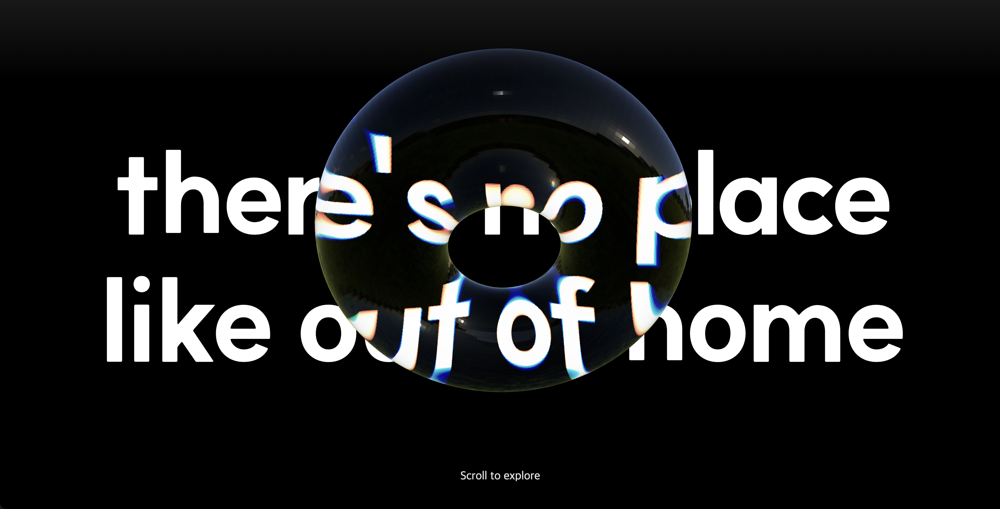

# R3F Scroll Showcase

스크롤 중심 인터랙션으로 설계한 모션 기반 웹 쇼케이스 작업물입니다. 
R3F(WebGL) 기반 3D 히어로, 가로 스크럽 섹션, 행성 레이어 패럴랙스를 하나의 흐름으로 연결해
"스크롤 자체가 연출이 되는 페이지"를 만드는 데 초점을 맞췄습니다.

## Preview

<p align="center">
  
</p>

## Live Demo

Vercel 배포 예정

## Overview

- `React + Vite` 기반의 싱글 페이지 인터랙티브 쇼케이스
- `GSAP ScrollTrigger`를 중심으로 각 섹션의 움직임을 스크롤과 직접 연결
- `@react-three/fiber`와 `@react-three/drei`로 WebGL 기반 3D 히어로 연출 구현
- 마지막 섹션은 다층 행성 이미지와 마우스 반응형 패럴랙스로 마무리

페이지는 크게 3개의 구간으로 구성됩니다.

1. R3F(WebGL)로 구현한 3D 도넛 오브젝트와 타이포그래피가 등장하는 히어로 섹션
2. 스크롤이 가로 이동으로 변환되는 pinned horizontal 카드 섹션
3. NASA 스타일 행성 이미지가 둥둥 떠다니는 floating scene 섹션

## Tech Stack

- `React 18`
- `Vite 5`
- `Sass`
- `GSAP`
- `ScrollTrigger`
- `@gsap/react`
- `@studio-freight/lenis`
- `three`
- `@react-three/fiber`
- `@react-three/drei`
- `Leva`

## Implemented Logic

### 1. Smooth Scroll

`Lenis`를 사용해 기본 브라우저 스크롤을 더 부드럽게 보정했습니다.  
`requestAnimationFrame` 루프 안에서 `lenis.raf()`를 지속 호출해 전체 페이지의 스크롤 감도를 통일했습니다.

관련 파일:
- [src/utils/lenis.js](src/utils/lenis.js)

### 2. Hero 3D Section

히어로 영역은 `@react-three/fiber` 기반 `Canvas` 위에 텍스트와 3D 오브젝트를 겹쳐, WebGL 특유의 깊이감과 질감을 살리는 방식으로 구성했습니다.

적용 포인트:
- `useGLTF`로 `torrus.glb` 로드
- `MeshTransmissionMaterial`로 유리처럼 비치고 굴절되는 도넛 질감 구성
- `useFrame`으로 렌더 시점 기준 은은한 idle rotation 적용
- `ScrollTrigger` 타임라인으로 스크롤에 따라
  - 상단 텍스트가 위로 빠지고
  - 도넛이 회전하며
  - 점점 작아지고
  - `FirstText` 섹션 중심까지 자연스럽게 정렬되도록 처리

관련 파일:
- [src/App.jsx](src/App.jsx)
- [src/components/Model/Model.jsx](src/components/Model/Model.jsx)

### 3. First Text Fade-In

중간 카피 섹션은 별도의 과한 움직임보다, 스크롤에 따라 부드럽게 등장하도록 단순하게 처리했습니다.

적용 포인트:
- `useGSAP`로 `.first_text_cont` opacity 애니메이션 연결
- 뷰포트 진입 시 자연스럽게 등장하도록 설정

관련 파일:
- [src/components/FirstText/FirstText.jsx](src/components/FirstText/FirstText.jsx)

### 4. Horizontal Scroll Section

이 프로젝트의 핵심 포인트 중 하나로, 세로 스크롤을 가로 이동 경험으로 변환했습니다.

적용 포인트:
- `track.scrollWidth - viewport.offsetWidth` 값을 이용해 실제 이동 거리 계산
- 섹션을 `pin`한 상태에서 `x` 값을 좌측으로 이동시키며 horizontal scrub 구현
- 별도 progress bar를 두고 진행률을 시각화
- 각 카드 내부에서는 `containerAnimation` 기반으로
  - 카드 콘텐츠가 뒤늦게 따라오고
  - orb가 카드마다 다른 속도로 움직이는 보조 패럴랙스 추가

관련 파일:
- [src/components/Horizontal/Horizontal.jsx](src/components/Horizontal/Horizontal.jsx)

### 5. Floating Planet Scene

마지막 섹션은 로컬에 저장한 행성 이미지들을 여러 레이어로 배치해, 깊이감 있는 우주 연출로 마무리했습니다.

적용 포인트:
- 각 행성은 `floatingItems` 배열로 관리
- 아이템별로 `size`, `top`, `left`, `speedX`, `speedY`, `depth`, `glow`, `image` 값을 개별 설정
- `gsap.quickTo()`로 마우스 이동값을 부드럽게 보간
- 각 레이어는 서로 다른 속도로 반응해 depth가 느껴지도록 구성
- 별도의 무한 `yoyo` 애니메이션으로 둥둥 떠 있는 느낌 유지
- 가운데 타이틀은 CSS 기반 dot matrix text로 처리
- 일부 행성은 ring 효과를 추가해 실루엣을 차별화

관련 파일:
- [src/components/FloatingScene/FloatingScene.jsx](src/components/FloatingScene/FloatingScene.jsx)
- [src/App.scss](src/App.scss)

## Project Structure

```bash
src
├── App.jsx
├── App.scss
├── components
│   ├── FirstText
│   │   └── FirstText.jsx
│   ├── FloatingScene
│   │   └── FloatingScene.jsx
│   ├── Horizontal
│   │   └── Horizontal.jsx
│   └── Model
│       └── Model.jsx
└── utils
    └── lenis.js
```

## Getting Started

```bash
npm install
npm run dev
```

Production build:

```bash
npm run build
npm run preview
```

## Notes

- 이 프로젝트는 인터랙션과 연출 흐름에 집중한 showcase 성격의 작업입니다.
- `Leva`는 transmission material 값 조정을 위한 실험용 컨트롤로 사용했습니다.
- `GSAP bonus` 패키지를 로컬 `gsap-bonus.tgz`로 연결해 사용하고 있습니다.
